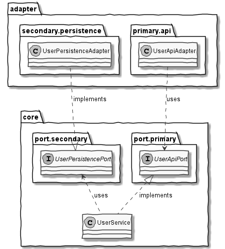

# poc-archunit

This repository contains a proof of concept, how violations of a given architecture pattern can be recognized
with [ArchUnit](https://www.archunit.org/) integrated into a Maven-lifecycle.

In order to do this, a simple CRUD-application with a "user"-domain is implemented in Java with the architecture
pattern ["Ports & Adapters"](https://medium.com/idealo-tech-blog/hexagonal-ports-adapters-architecture-e3617bcf00a0).

## System Architecture

* The `UserService` in package `core` is available to the outside world via an Api (`UserApiAdapter` - a primary
  adapter)
  and stores/loads entities via a persistence layer (`UserPersistenceAdapter` - a secondary adapter)
* The adapters and the `UserService`
  are loosely coupled via port-interfaces, which are located in sub-packages of the `core` package.
* A class `UserModule` in package `configuration` puts all the stuff together, but is not a part of the "Ports &
  Adapters" pattern. That one and a couple of other classes are left out of the following diagram to reduce clutter and
  emphasize the "Ports & Adapters" approach.

For simplicity reasons, neither api nor persistence are implemented using frameworks like Spring. They are only coded as
simple stubs instead.

## Tests

To show the inclusion of ArchUnit into the Maven build & testing lifecycle in conjunction with other types of tests, a
couple of integration tests and unit tests are realized as well, but they do not cover the whole functionality.

### ArchUnit

The following relations between classes & interfaces are checked with ArchUnit:

* Stuff in package `core.service` **may not** be accessed from the outside
* Stuff in package `adapter` **may not** be accessed from the outside
* Stuff in package `core.port.primary` **may only** be accessed from `core.service` and `adapter.primary`
* Stuff in package `core.port.secondary` **may only** be accessed from `core.service` and `adapter.secondary`

The `UserModule`-class in package `configuration` - gluing it all together - obviously needs to access all the classes &
interfaces to inject dependencies. So this package gets special treatment in the ArchUnit-tests.

#### Disclaimer

There are certainly many more best-practices concerning relations between packages, classes and interfaces, that are
also worth to be checked with ArchUnit, but only the afore-mentioned ones are realized in this proof of concept.

